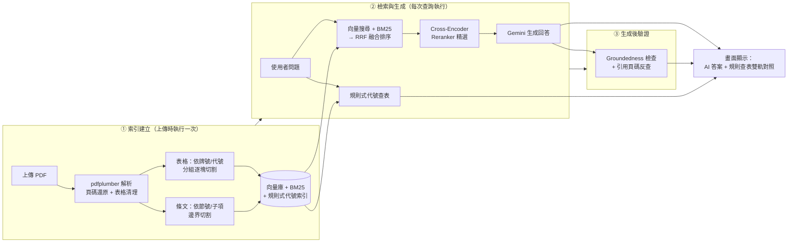
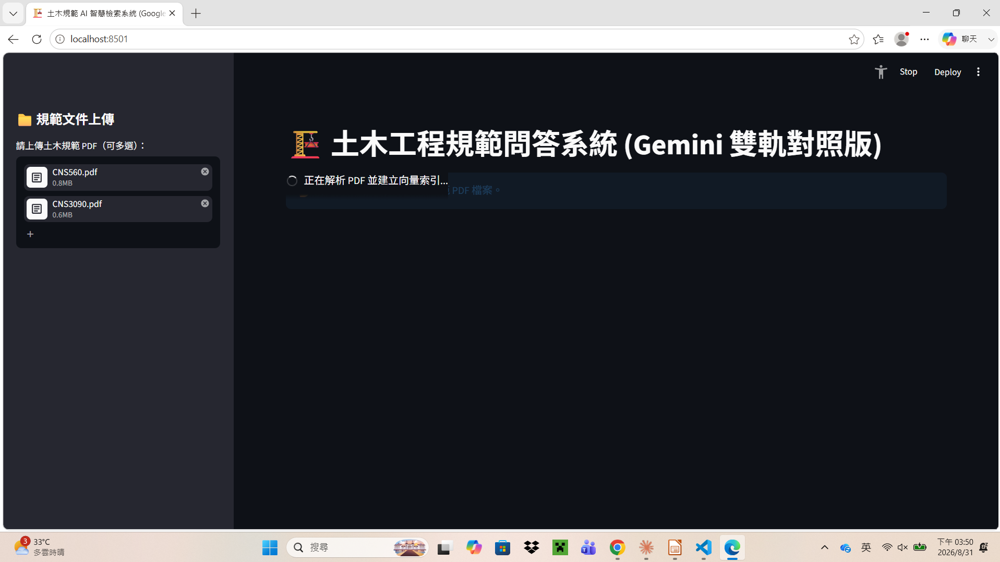
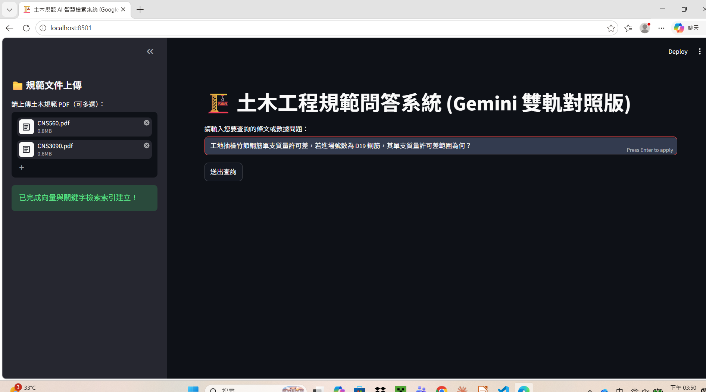
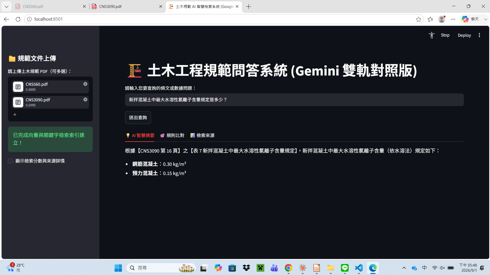
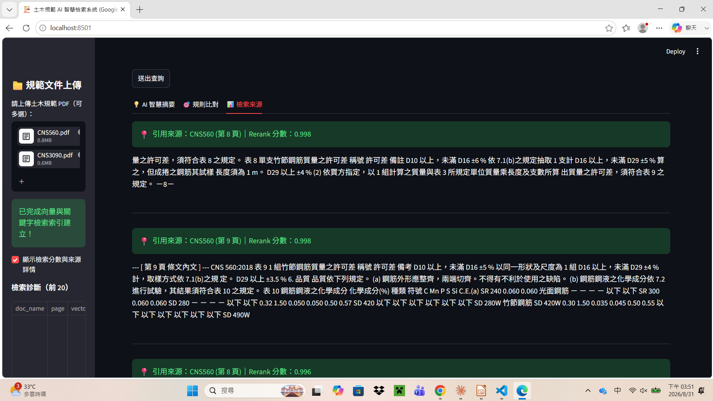
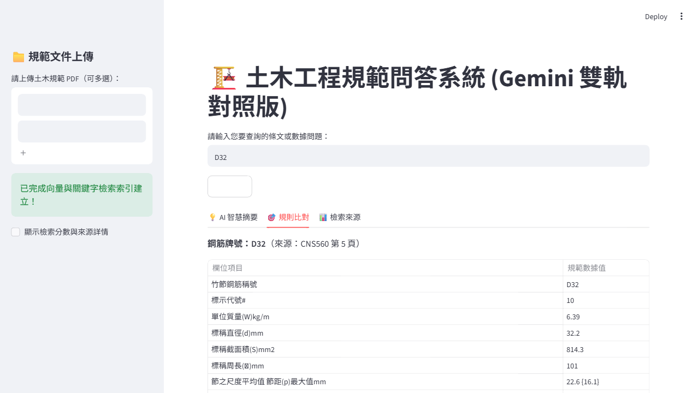

# 土木工程規範問答系統（RAG 雙軌對照版）

以 Retrieval-Augmented Generation（RAG）為核心的土木規範 PDF 問答工具。使用者上傳規範 PDF後，可直接用自然語言提問（例如「SD420 的抗拉強度規定是多少？」），系統會從文件中檢索相關條文與數據表格，交給 Gemini 生成精確、可追溯來源的回答，並額外提供規則式查表結果做雙軌對照。

## 動機

土木工程規範文件（CNS 標準、施工規範等）動輒數百頁，內含大量表格化數據（鋼筋牌號、材料容許差、強度規定等），工程人員在審查或施工時常需要「翻頁找數字」，效率低且容易漏看。這個專題嘗試用 RAG 架構，讓使用者用自然語言提問就能快速定位到正確條文與數值，並透過多層機制降低 LLM 生成答案時「編造數字」的風險——這對規範查詢這種容錯率極低的場景尤其重要。

### 與原型 ConSpec-Agent 的差異

這個專題最初源自筆者在團隊專題 **ConSpec-Agent**（工程品質審查系統）中負責的法規問答模組。實際比較後，發現原模組的風險在於「檢索到什麼就直接信什麼」——沒有排序品質驗證，也沒有生成後的事實查核，對規範查詢這種容錯率極低的場景並不安全。因此把這部分獨立拉出來重新設計：

| | ConSpec-Agent 原模組 | 這個獨立專題 |
|---|---|---|
| 檢索方式 | 單純向量檢索 | 向量 + BM25 + RRF 融合排序 |
| 排序品質把關 | 無（向量分數直接排序） | Cross-Encoder Reranker 二次精選 |
| 生成後查核 | 無 | Groundedness 檢查 + 引用頁碼反查 |
| 表格資料處理 | 原始文字直接餵給 LLM | 結構化清理成乾淨表格，並依牌號/代號分組 |
| 關鍵數值查詢 | 完全依賴 LLM 生成 | 額外提供規則式查表，雙軌互相驗證 |

也就是說，這不是「重做一個類似的東西」，而是拿同一個問題域，把原本「檢索到就相信」的單軌設計，換成「檢索、排序、生成、查核」四層都各自有把關機制的架構，並用系統性測試（見下方「成效驗證」）逐一驗證每一層真的有解決問題。

## 系統架構



## 技術亮點

一般入門 RAG 教學通常只有「向量檢索 → LLM 生成」兩步，這個專題額外做了以下幾層強化：

| 環節 | 做法 | 目的 |
|---|---|---|
| PDF 頁碼還原 | 逐頁偵測印刷頁碼，找不到的用鄰近錨點局部內插，而非單一全域 offset | 附錄重新編號、章節跳頁時，引用頁碼仍然正確 |
| 表格結構化清理 | 合併多列表頭、向下補值（forward-fill）、去重複列，並用多重特徵（牌號、範圍字眼、代號、數值比例）辨識資料列 | 把 PDF 表格斷裂、跨頁的原始資料還原成乾淨的 Markdown 表格，涵蓋純數字表格等原本會被誤判丟棄的格式 |
| 依節號/子項邊界切割 | 取代固定字數切割，讓每個 chunk 盡量對應一條完整條文；同一節號底下有多個不同主題子項時再依 (a)(b)(c) 邊界細分 | 避免不相關條文被黏在同一個 chunk、或在條文中間斷句 |
| 混合檢索 | 向量語意搜尋（cosine 相似度 + 分數門檻過濾）+ BM25 關鍵字搜尋 | 語意相近與精確關鍵字命中互補，避免單一方法的盲區 |
| RRF 融合排序 | Reciprocal Rank Fusion 依兩路排名加權合併，並用「向量核可清單」擋掉 BM25 純字面命中的雜訊 | 比簡單聯集更可靠的排序依據 |
| Cross-Encoder Reranker | 用 `BAAI/bge-reranker-base` 對候選文件重新精算相關性分數，並依分數門檻過濾雜訊 | 比向量/BM25 各自獨立打分更準，是檢索品質的最後一道把關 |
| Groundedness 檢查 | 比對答案中的數值是否出現在檢索到的原文中（並濾除 LLM 自己排版用的列表編號，降低誤報） | 攔截「檢索沒命中、LLM 卻自己編數字」的幻覺 |
| 引用頁碼反查 | 答案引用的頁碼若不在這次檢索範圍內，主動跳警告 | 防止 LLM 編造看似合理但查無來源的引用 |
| 精確節號/表號引用 | 從條文自動偵測節號（如「17.4」）、從表格標題偵測表號（如「表9」），優先於頁碼顯示 | 頁碼會隨規範改版跳頁，節號/表號較穩定，是更可靠的引用依據 |
| 規則式雙軌對照 | 用正則規則直接從表格索引查表，支援 SD/SR 鋼筋牌號與 D 標稱尺寸代號兩種格式 | 不透過 LLM，對關鍵數值提供一條獨立、可驗證的查詢路徑 |
| 中文 BM25 逐字分詞 | 中文詞語間沒有空白，`text.split()` 對長句完全失效；改用「英數字連續當一個 token、中文逐字拆開」的正則分詞 | 修正混合中英文查詢在 BM25 全部零分、退化成語料庫亂序雜訊的問題 |
| 表格依代號分組切塊 | 依「符號/牌號」重複分組，或依「純代號格式」判斷逐列切開，並在自然語言摘要明講「這段是哪個代號」 | 避免整張大表被當一個 chunk 時，稀釋掉單一牌號/代號查詢的相關性 |
| 向量核可閘門動態放寬 | 除了向量前 k 名，BM25 排名前 3 名的候選也一律放行，不限於代號類查詢 | 修正一般問句（如「鋼筋種類分幾種」）被閘門誤擋、答成查無相關規定的問題 |
| 生成 Prompt 措辭校準 | 避免 prompt 過度強調「數值」，改成數值、規定或處理程序皆可直接回答 | 修正程序性問題（如「怎麼處理」）因用詞被模型誤判為「無數值可答」而拒答 |
| 索引建立分批 Embedding | 冷啟動建索引時把 chunk 分批寫入向量庫，而非一次性送進 `Chroma.from_documents()` | 降低尖峰記憶體用量，避免在資源有限環境下建索引時程序被系統砍掉 |

## 實際運作截圖

**上傳規範 PDF、建立索引**



**輸入查詢問題**



**AI 智慧摘要：精確引用頁碼與表格編號回答**



**檢索來源：可看到每筆候選的 Rerank 分數**



**規則比對：SD/SR 鋼筋牌號與 D 標稱尺寸代號皆可直接查表，跟 AI 答案雙軌對照**



## 成效驗證（量化比較）

不只是文字描述「有變好」，以下是實測過的具體案例，依效果規模排序：

**BM25 中文分詞：修正前後對照**

實測查詢「SD420W和SD690的抗拉強度和降伏強度」（句子沒有任何空白）：

| | 修正前 | 修正後 |
|---|---|---|
| 分詞結果 | 整句被當成唯一一個 token，跟語料庫任何文件都對不上 | 拆成「SD420W」「和」「SD690」「的」「抗」「拉」...等有意義的 token |
| BM25 前 2 名 | 跟問題完全無關的另一份文件內容（分數靠語料庫排列順序決定，接近雜訊） | SD420W、SD690 專屬表格 chunk（分數 27.7、27.2，遠高於其他候選） |

**生成 Prompt 措辭：修正前後對照**

| | 修正前 | 修正後 |
|---|---|---|
| 測試輸入 | 「鋼筋重驗不合格時怎麼處理」 | 同一問題 |
| 檢索狀態 | 正確段落已檢索到，Reranker 分數 0.965（滿分等級） | 同一份 context |
| 最終答案 | 「查無相關規定，請人工確認」 | 正確列出 7.4 節重驗程序 |
| 原因 | Prompt 反覆強調「數值」，模型把「怎麼處理」這類程序性問題誤判為無數值可答 | 措辭改為「數值、規定或處理程序皆可直接回答」 |

**清單型查詢候選池放寬：修正前後對照**

實測查詢「竹節鋼筋的標示代號有哪些」（表格共有 13 個代號）：

| | 修正前 | 修正後 |
|---|---|---|
| 候選來源 | 分組後的單代號 table chunk 各自跟其他段落競爭候選名額 | 清單型問句觸發候選池放寬 + 未切塊表格索引兜底 |
| 最終答案 | 只列出 D10～D25，共 6 個代號 | 完整列出 D10～D57，全部 13 個代號 |
| 原因 | `FINAL_TOP_N` 上限 + 分散 chunk 排名不穩定，未涵蓋的代號被擠出候選池 | 偵測清單型問句後直接從未切塊的表格資料補上完整內容 |

**表格辨識覆蓋率：全面掃描前後對照**

系統性掃描兩份規範全部頁面，比對「pdfplumber 有偵測到表格結構」與「清理後實際產出乾淨表格」的差異，找出所有辨識失敗的頁面，而非等使用者回報才個別修正：

| | 修正前 | 修正後 |
|---|---|---|
| 疑似辨識失敗頁面數 | 24 頁 | 11 頁 |
| 剩餘頁面性質 | 部分為真正表格辨識失敗 | 逐頁人工確認，**全部**為封面／目錄／修訂歷史等本來就不是表格的內容 |

修正方式是把「這一列是不是資料列」的判斷規則，從只認得 SD/SR 牌號與「以上/以下」範圍字眼，擴充為同時支援標稱尺寸代號與數值比例特徵，涵蓋了原本會被誤判「整張表全是表頭、沒有資料列」而遭丟棄的表格。

**Cross-Encoder Reranker：檢索精準度**

實際查詢「新拌混凝土中最大水溶性氯離子含量規定是多少？」（見上方截圖），最相關的候選文件（CNS3090 表 7）Reranker 分數達 **1.000**（滿分 1.0），顯示候選文件跟問題的語意相關性非常高，確保送進 LLM 的 context 都是真正相關的內容，而非「矮子裡拔高個」湊出來的次要結果。

**Groundedness 誤報率：修正前後對照**

規模較小、但反映測試涵蓋到多細的邊界情況：原始版本的防幻覺檢查會把答案裡所有數字都拿去跟原文比對，但這樣連 LLM 自己排版用的列表編號也會被誤判成「查無依據的數字」：

| | 修正前 | 修正後 |
|---|---|---|
| 測試輸入 | 含列表編號的答案（如「1. 降伏強度 420 MPa」「2. 抗拉強度 620 MPa」「(3) 伸長率 12%」） | 同一段答案 |
| 誤報數量 | 3 個（`1`、`2`、`3` 被誤判為查無原文依據） | 0 個 |
| 原因 | 直接抓答案裡所有數字比對 | 比對前先濾除行首的列表編號，只比對內文真正的數值 |

**正式測試結果**：完成本輪所有修正後，以 50 題涵蓋兩份規範的測試集驗證，**嚴格正確率 92%（46/50）**，含部分正確計分則為 94%。所有失敗與部分正確案例都已定位根本原因並記錄，無原因不明的案例。完整測試明細、每題的正確答案依據與逐題結果請見 [TESTING.md](TESTING.md)。

## 技術棧

- **前端 / 應用框架**：Streamlit
- **PDF 解析**：pdfplumber
- **向量資料庫**：Chroma
- **Embedding 模型**：`sentence-transformers/paraphrase-multilingual-MiniLM-L12-v2`
- **Reranker 模型**：`BAAI/bge-reranker-base`
- **關鍵字檢索**：BM25（rank_bm25）
- **LLM**：Google Gemini（透過 `langchain-google-genai`）
- **框架整合**：LangChain

## 安裝與執行

```bash
pip install -r requirements.txt
```

設定 Google API 金鑰（金鑰只能來自環境變數，不寫死在程式碼中）：

```bash
export GOOGLE_API_KEY=你的金鑰
```

啟動應用程式：

```bash
streamlit run "rule engine.py"
```

開啟瀏覽器後，於左側欄上傳規範 PDF，即可開始提問。

## 專案結構

```
.
├── rule engine.py      # 主程式：PDF 解析、混合檢索、RAG 問答、防幻覺驗證
├── requirements.txt    # 相依套件版本
└── .chroma_store/      # 向量庫與解析結果快取（依上傳檔案內容雜湊分版本存放）
```

## 已知限制與未來規劃

- **模型選擇受硬體限制**：Reranker 原先採用效果更好的 `BAAI/bge-reranker-v2-m3`（5.68 億參數），但在記憶體有限的機器上會導致程序被系統強制終止，因此改用較輕量的 `bge-reranker-base`，是準確度與可運行性之間的取捨。
- **Groundedness 檢查仍屬粗略比對**：目前以數字集合差集判斷，未涵蓋單位、語意層級的一致性檢查。
- **語料範圍**：目前僅支援使用者臨時上傳的 PDF，尚無固定的規範資料庫版本管理機制。
- **規則式查表覆蓋範圍**：目前支援 SD/SR 鋼筋牌號與 D 標稱尺寸代號兩種格式，其他規範數值（如混凝土強度等級、坍度數值區間）需要「數值範圍比對」而非「精確代號比對」，屬於不同複雜度的擴充，尚未涵蓋。
- **窮舉型清單問題，表格類已修正、純文字類仍有限制**：問「列出所有 XX」這種需要彙整多個 chunk 才能答全的問題，若答案來自某張已被分組切塊的表格（例如 13 個代號的表 3），系統會在偵測到清單型問句時，動態放寬候選池並直接從未切塊的 `table_index` 補上完整表格內容，不受個別 chunk 排名不穩定的影響。但若答案是分散在條文裡的純文字列舉（例如某條文列了 9 個項目、分散在該條文的不同段落），目前仍受限於送進 LLM 的候選數上限，可能只答出部分項目，尚待針對這類純文字清單設計對應的兜底機制。
- **短句 chunk 對通用字查詢的命中率較低**：中文 BM25 採逐字元分詞，若某條文本身很短（例如只有一句「拌和用水應符合 CNS 13961 之規定」）且查詢只共用「水」這類單一常見字（而非「化學摻料」這種多字詞組），字元層級的區分度不夠，可能檢索不到——這是逐字元分詞方法的結構性限制，非隨機性 bug。
- **PDF 圖示型標示範例經純文字擷取後會失去空間對應關係**：pdfplumber 的文字擷取只保留閱讀順序，不保留座標位置，遇到「一排代號＋下方對應標籤」這種圖示型排版（例如鋼筋標示範例圖），標籤與代號的對應關係在純文字裡會變得模糊，LLM 有時會猜錯配對方向（例如把兩個相鄰欄位的意義對調），這是 PDF 純文字擷取先天的限制，不是檢索邏輯的問題。
