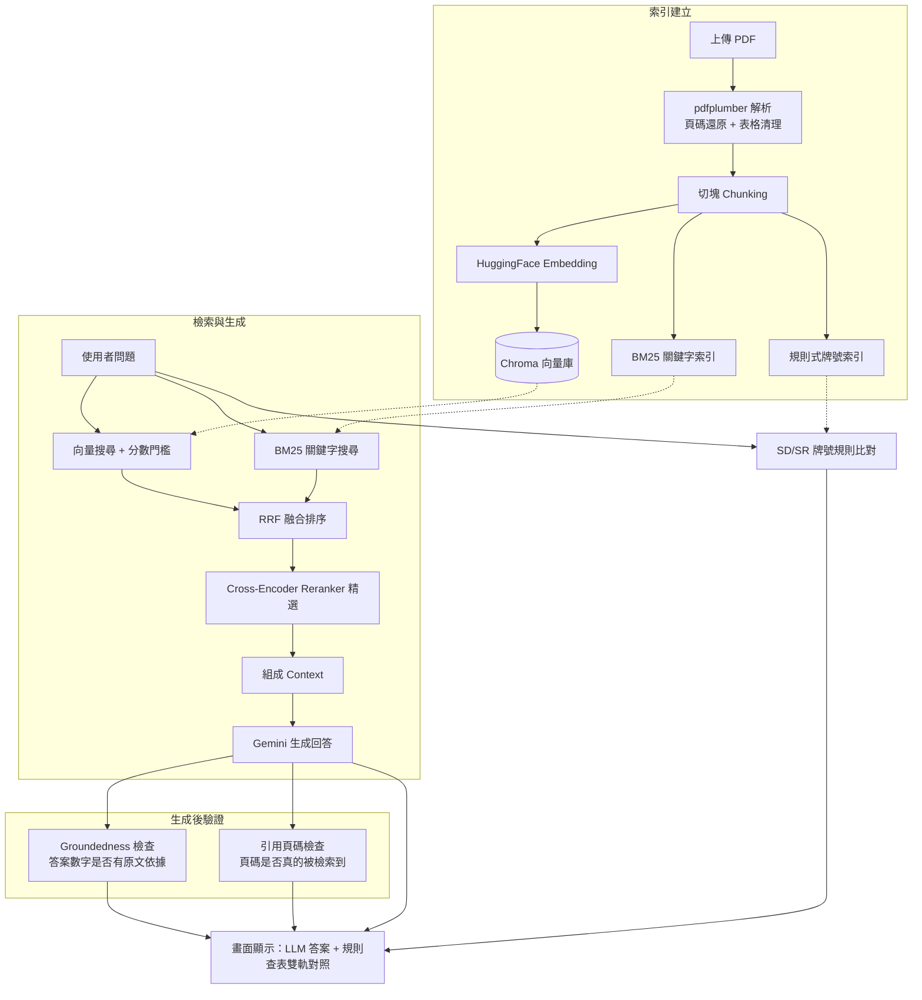

# 土木工程規範問答系統（RAG 雙軌對照版）

以 Retrieval-Augmented Generation（RAG）為核心的土木規範 PDF 問答工具。使用者上傳規範 PDF後，可直接用自然語言提問（例如「SD420 的抗拉強度規定是多少？」），系統會從文件中檢索相關條文與數據表格，交給 Gemini 生成精確、可追溯來源的回答，並額外提供規則式查表結果做雙軌對照。

## 動機

土木工程規範文件（CNS 標準、施工規範等）動輒數百頁，內含大量表格化數據（鋼筋牌號、材料容許差、強度規定等），工程人員在審查或施工時常需要「翻頁找數字」，效率低且容易漏看。這個專題嘗試用 RAG 架構，讓使用者用自然語言提問就能快速定位到正確條文與數值，並透過多層機制降低 LLM 生成答案時「編造數字」的風險——這對規範查詢這種容錯率極低的場景尤其重要。

## 系統架構



## 技術亮點

一般入門 RAG 教學通常只有「向量檢索 → LLM 生成」兩步，這個專題額外做了以下幾層強化：

| 環節 | 做法 | 目的 |
|---|---|---|
| PDF 頁碼還原 | 逐頁偵測印刷頁碼，找不到的用鄰近錨點局部內插，而非單一全域 offset | 附錄重新編號、章節跳頁時，引用頁碼仍然正確 |
| 表格結構化清理 | 合併多列表頭、向下補值（forward-fill）、去重複列 | 把 PDF 表格斷裂、跨頁的原始資料還原成乾淨的 Markdown 表格 |
| 混合檢索 | 向量語意搜尋（cosine 相似度 + 分數門檻過濾）+ BM25 關鍵字搜尋 | 語意相近與精確關鍵字命中互補，避免單一方法的盲區 |
| RRF 融合排序 | Reciprocal Rank Fusion 依兩路排名加權合併，並用「向量核可清單」擋掉 BM25 純字面命中的雜訊 | 比簡單聯集更可靠的排序依據 |
| Cross-Encoder Reranker | 用 `BAAI/bge-reranker-base` 對候選文件重新精算相關性分數 | 比向量/BM25 各自獨立打分更準，是檢索品質的最後一道把關 |
| Groundedness 檢查 | 比對答案中的數值是否出現在檢索到的原文中（並濾除 LLM 自己排版用的列表編號，降低誤報） | 攔截「檢索沒命中、LLM 卻自己編數字」的幻覺 |
| 引用頁碼反查 | 答案引用的頁碼若不在這次檢索範圍內，主動跳警告 | 防止 LLM 編造看似合理但查無來源的引用 |
| 規則式雙軌對照 | 額外用正則規則直接從表格索引查 SD/SR 鋼筋牌號數據 | 不透過 LLM，對關鍵數值提供一條獨立、可驗證的查詢路徑 |

## 技術棧

- **前端 / 應用框架**：Streamlit
- **PDF 解析**：pdfplumber
- **向量資料庫**：Chroma
- **Embedding 模型**：`sentence-transformers/paraphrase-multilingual-MiniLM-L12-v2`
- **Reranker 模型**：`BAAI/bge-reranker-base`
- **關鍵字檢索**：BM25（rank_bm25）
- **LLM**：Google Gemini（透過 `langchain-google-genai`）
- **框架整合**：LangChain

## 安裝與執行

```bash
pip install -r requirements.txt
```

設定 Google API 金鑰（金鑰只能來自環境變數，不寫死在程式碼中）：

```bash
export GOOGLE_API_KEY=你的金鑰
```

啟動應用程式：

```bash
streamlit run "rule engine.py"
```

開啟瀏覽器後，於左側欄上傳規範 PDF，即可開始提問。

## 專案結構

```
.
├── rule engine.py      # 主程式：PDF 解析、混合檢索、RAG 問答、防幻覺驗證
├── requirements.txt    # 相依套件版本
└── .chroma_store/      # 向量庫與解析結果快取（依上傳檔案內容雜湊分版本存放）
```

## 已知限制與未來規劃

- **模型選擇受硬體限制**：Reranker 原先採用效果更好的 `BAAI/bge-reranker-v2-m3`（5.68 億參數），但在記憶體有限的機器上會導致程序被系統強制終止，因此改用較輕量的 `bge-reranker-base`，是準確度與可運行性之間的取捨。
- **Groundedness 檢查仍屬粗略比對**：目前以數字集合差集判斷，未涵蓋單位、語意層級的一致性檢查。
- **語料範圍**：目前僅支援使用者臨時上傳的 PDF，尚無固定的規範資料庫版本管理機制。
